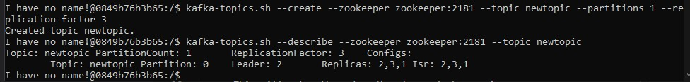

# CS3219 Task D

Create a 3 node Apache Kafka cluster using Docker that demonstrates the Pub-Sub messaging, with a Zookeeper ensemble created to manage the Kafka cluster.

The task is only tested on Windows platform, so I can only gurantee it will work on the Windows platform.

## Notes
- You will be required to use 3 terminals to test this task, which are **setup-terminal**, **publisher-terminal** and **subscriber-terminal**.
- All of the terminals should at the root directory `task-d`.
- The container created by **publisher-terminal** and **subscriber-terminal** will auto destroy after exit the terminal.

## Setup
1. You are required to download and install [Docker Desktop](https://www.docker.com/products/docker-desktop).
2. Clone this repository by `git clone https://github.com/sheexiong/task-d.git`.
3. Navigate to the root directory by `cd task-d`.
4. Open **setup-terminal** and run **docker-compose up -d**.
5. Now open the Desktop Docker to verify 1 zookeeper and 3 kafka container are created and running as shown in Figure 1.

    \
    *Figure 1*

6. Open **publisher-terminal** and run `publisher.bat` windows batch file.
7. Open **subscriber-terminal** and run `subscriber.bat` windows batch file.
8. This 2 steps will create publisher container and subscriber container that will conenct to the same network as the Kafka Cluster container.
    - Note that this 2 terminals now will run in Kafka container instead of Windows.
9. Now lets create a new topic by using **publisher-terminal** to run `kafka-topics.sh --create --zookeeper zookeeper:2181 --topic newtopic --partitions 1 --replication-factor 3`.
    - This will create a new topic called "newtopic" which will be used by the Pub-Sub messaging system later.
10. We can verify the topic is created successfully by using **publisher-terminal** to run `kafka-topics.sh --zookeeper zookeeper:2181 --list`.
    - There is only "newtopic" which just created by us in the topic list.
11. We can check which kafka is assigned to leader by using **publisher-terminal** to run `kafka-topics.sh --describe --zookeeper zookeeper:2181 --topic newtopic` as shown in Figure 2.
    \
    *Figure 2: Note that id for kafka1, kafka2 and kafka3 are **1, 2 and 3** respectively.*
12. In my case, the leader for this partition is kafka2 (Leader: **2**).

## Run Task D
This instruction will continue from [Setup](##setup) section. Please don't close any terminal from the [Setup](##setup) section.

1. Use **subscriber-terminal** to run `kafka-console-consumer.sh --bootstrap-server kafka1:9092,kafka2:9092,kafka3:9092 --topic newtopic --from-beginning`.
    - This will setup the subscriber to ready to receive any message from "newtopic" when there is publisher publish the new message to the "newtopic".
2. Use **publisher-terminal** to run `kafka-console-producer.sh --bootstrap-server kafka1:9092,kafka2:9092,kafka3:9092 --topic newtopic`.
    - This will create the publisher to ready to publish any new message to the "newtopic".
3. Now you can type in any message to the **publisher-terminal**. After you press enter, it will publish the message to the "newtopic" and you should see the same message printed at the **subscriber-terminal**.
4. After finish sending the messages, you can exit the publishing mode and receiving mode in the **publisher-terminal** and **subscriber-terminal** by using `CTRL + C` in the terminal.

## Simulate failure of leader(master) node
This instruction will continue from [Run Task D](##Run-Task-D) section. Please don't close any terminal from the [Run Task D](##Run-Task-D) section.

1. Lets confirm again which kafka container is the current leader for the partition by using **publisher-terminal** to run `kafka-topics.sh --describe --zookeeper zookeeper:2181 --topic newtopic`.
    
    - We can see that current leader is kafka2 (Leader: **2**).
2. Now lets simulate the leader node is down by using the **setup-terminal** to run `docker-compose stop kafka2` to stop the kafka2 container.
3. Note that we might need to wait a while for zookeeper to notice the leader node not available.
3. Then we use **publisher-terminal** to run again `kafka-console-producer.sh --bootstrap-server kafka1:9092,kafka2:9092,kafka3:9092 --topic newtopic` and **subscriber-terminal** to run `kafka-console-consumer.sh --bootstrap-server kafka1:9092,kafka2:9092,kafka3:9092 --topic newtopic --from-beginning`
    - If the **subscriber-terminal** does not show the all previous messages, you can use `CTRL + C` to stop the receiving mode and rerun again with the command in step 3.
4. You might notice after running the step 3 command, both terminals will show the warning about unable resolve the server kafka2:9092, but this does not affect the functionally of the message system.
5. We can use the **publisher-terminal** to publish new message and observe that the **subscriber-terminal** will receive the message afterward.
6. Now lets use `CTRL + C` to exit publishing mode in **publisher-terminal** and run `kafka-topics.sh --describe --zookeeper zookeeper:2181 --topic newtopic` to see the new leader.
    \
    Note that the new leader now is kafka3 (Leader: **3**).
7. You can exit the both terminals by using `CTRL + D`. After exit **publisher-terminal** and **subscriber-terminal**, the respective container will auto destroy.

## References
- [Bitnami Docker Image for Kafka](https://github.com/bitnami/bitnami-docker-kafka)
- [Docker Run Reference](https://docs.docker.com/engine/reference/run/)